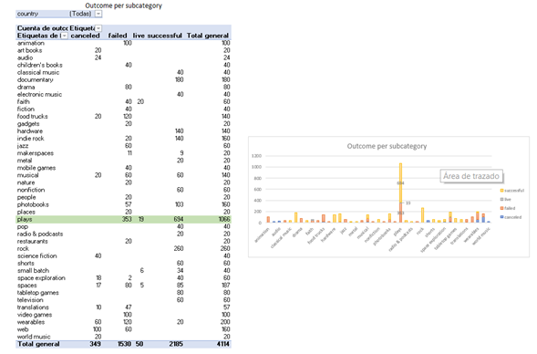

# KICKSTARTING WITH EXCEL

## OVERVIEW OF PROJECT
Louise wants to begin a crowfunding campaign to get the necessary money to fund her play “Fever”.  Her budget is of $10,000 and needs some help to understand if there are specific factors that make the campaigns success or fail.
For helping Louise, is necessary to analyze the given information that contains important data about the theater funding and other funding categories, like film& video, music or television, including the quantitative one like the initial goal amount and the pledged one. 

### Purpose

The purpose of this project is nalyze the available data and then, give Louise some insights regarding the theater category and “plays” subcategory that can help her to make a decision about how to drive her crowfunding campaign.
## ANALYSIS AND CHALLENGES
The excel file contained information not only for the theater funding projects but as early was mentioned, also included information about other categories. In order to have only the useful information for this analysis, was required to use pivot tables and filter the information for getting the desired results.
The created pivot tables and their corresponding graphs gave us information about the parent category “theater” and subcategory “plays” in relation with the other categories or subcategories. 
The first pivot table, shows the information about the different outcomes for all the categories; as we can see in the following image, the category with more campaigns is “theater” , including all the subcategories, it has 839 successful campaigns, 493 failed, 37 canceled and 24 live.

Looking for more detail about this category, in the second pivot table is presented how many campaigns were successful, live, failed or canceled for every existing subcategory in the parent category “theater”; as shown below, among all the subcategories the one with more campaigns is “plays” with 694 successful, 19 live, 353 failed and none canceled.

### Analysis of outcomes Based on Launch Date

The third pivot table was created to see further about the “plays” information; in this case, it shows for every launching year and month, how many campaigns were successful, live, failed or canceled. Since the previous pivot table, we know that there were no canceled campaigns, and, as shown below, because of the number of successful campaigns, maybe the most “adequate” months to launch one are February, May, June and July.

Furthermore, this general information, is necessary to get numbers as percentages, or central tendency measures; for this, it was necessary to review all columns of the file and identify which ones can give usable information. From the universe of 20 columns, the ones with relevant data to do this type of analysis are:
	
    Goal
	Pledged
	Outcomes
	Country 
	Currency
	Parent Category
	Subcategory
	Dates (launched and deadline)
    Years
Now that the important columns for the analysis are decided, filtering the information, with the parent category as “Theater” and the subcategory as “plays”, gives the universe to work with. The file now looks like this:

### Analysis of outcomes Based on Goals

With this new data set, we only have now 1,066 rows with all the concerning information of the parent category “theater” and subcategory “plays”, from this total, the 65.1032% of the campaigns were successful, and the 33.1144% failed. Despite the country, the average goal amount in dollars is $7,177.82, and the average pledged amount in dollars is $3,684.92, with a 110.95% of average pledged amount for the successful campaigns. Disaggregating the information per every outcome, we have next summary:

Making ranges of the goal amount, the percentage of successful and failed “plays” campaigns in USD are:

With all the above information, now inference about relationships and correlations can be set in order to identify more patterns that match with the characteristics of Louises project and then, a potential outcome may be defined: if it could be successful or if there are some probabilities of failing.

### Challenges and Difficulties Encountered

Finally, working with this dataset was not so difficult because the information was in a tabular arrangement without blanks or weird information that could represent problems. When I first saw the data, the only thing I found different was the date format, and I think that for the purpose of this analysis, beside the theater data, it has a lot of information about other categories that are a little bit useless.

## RESULTS

**1.**	The theater outcomes by launch date, includes all the theater subcategories, just adding all the years and presenting the gathered information by month, without taking in account the currency and the country, presenting the information as follows:

I think a better approach to see this information, is including to it an additional filter adding the currency data, in order to have a more accurate vision of the impact of the launch date in the campaign outcome. As seen in the information above, if we take just the “plays” data, with the USD filter, then the result makes us think, as initial conclusion, that January or May will be the most “adequate” month to launch de campaign in order to get success, and without all the noise make by other subcategories, currencies and countries.
Also, the average per month, let us conclude that May could be the right month to launch the campaign:

**2.** Because a big part of the information is represented by the information belonging to US, there´s not a big difference in the outcomes based on goals as an overall, or applying a filter only containing USD as currency or US as country. As we can see in the table and graph above, for the range of a goal between $10,000 and $14,999 just for the plays, a 54.386% of the campaigns where successful; while seeing the results of all the ranges, the average of the failed campaigns has a goal of $10,554.21, having, the successful ones, an average goal of $5,048.88.

**3.**	As mentioned earlier, the dataset has a lot of information that is not relevant for the analysis we are doing. Maybe if we try to make an analysis of the global campaigns in the entertainment industry, all the data should be used, but just to help Louise with her campaign, the information referring to theater category is sufficient. In order to make a much more accurate analysis, the monthly information should be comparable, I mean, clarify that the range of dates includes 10 or 5 years (or the defined period). Columns like “staff pick”, do not help or have meaning at all.

**4.**	To have deeper analysis and obtain better conclusions or recommendations for Louise, we could use, for example, dispersion diagrams to see the relationship between the outcomes and the country or have more understanding about the launched date and the successful or failing rate.
Regarding the goal amount, we can use some dispersion measures and figures like histograms in order to know the dispersion and the distribution. Also, we can identify what kind of correlation exists between the successful rate, the subcategory and country.

